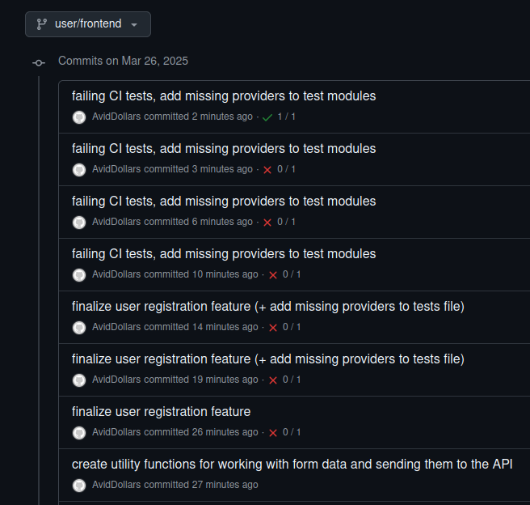
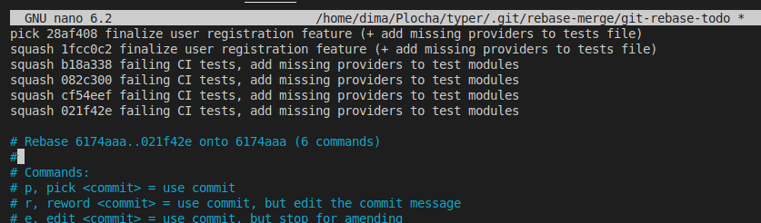
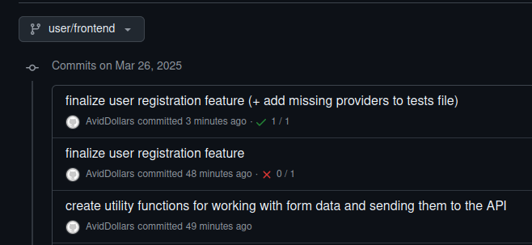

# Instructions for various task during development


## Squashing unnecessary commits (e.g. CI is failing):

**Problem**:
You have extra commits pushed to the repository because of failing tests in CI:


**Solution**:
1. checkout a branch with the commits you wanna squash (e.g. **user/frontend** branch)

2. use **rebase** command in **interactive mode**:
```bash
# squashing last 6 commits
git rebase -i origin/user/frontend~6 user/frontend
```

3. "**pick**" last commit, and "**squash**" the other ones:


4. **update commit message** after the squashing

5. **push changes** to a repository (in this case **user/frontend** branch):
```bash
# '+' for pushing to only one branch
git push origin +user/frontend
```

6. **check the commits** for a branch (in this case **user/frontend** branch):


## Modifying database schema / running migrations:

**Task**:
todo

**Solution**:
todo