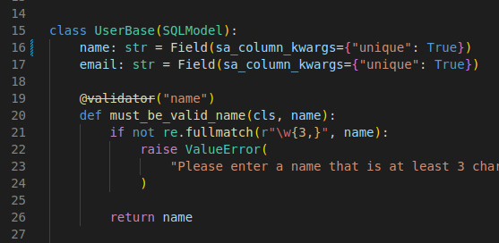
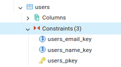

# Instructions for various task during development


## Squashing unnecessary commits (e.g. CI is failing):

**Problem**:
You have extra commits pushed to the repository because of failing tests in CI:


**Solution**:
1. checkout a branch with the commits you wanna squash (e.g. **user/frontend** branch)

2. use **rebase** command in **interactive mode**:
```bash
# squashing last 6 commits
git rebase -i origin/user/frontend~6 user/frontend
```

3. "**pick**" last commit, and "**squash**" the other ones:


4. **update commit message** after the squashing

5. **push changes** to a repository (in this case **user/frontend** branch):
```bash
# '+' for pushing to only one branch
git push origin +user/frontend
```

6. **check the commits** for a branch (in this case **user/frontend** branch):


## Modifying database schema / running migrations:

**Task**:
You need to change schema of one of the tables (in this case **adding unique contraint**)

**Solution**:
1. **change model** (in this case **add unique name constraint**):


2. goto to the running container for backend:
```bash
# 769 -> 1st 3 letters of running backend container
docker exec -it 769 bash
```

3. run migration:
```bash
# you must be inside "/backend" folder in order to run alembic commands:
cd /backend

# create new revision and provide description, e.g.:
alembic revision --autogenerate -m "add 'unique name' constraint on 'users' table"

# run the migration:
alembic upgrade head
```

4. log into running **pgAdmin** container (**localhost:5050**) and check the changes:


5. commit changes (file where model was changed + new migration file)